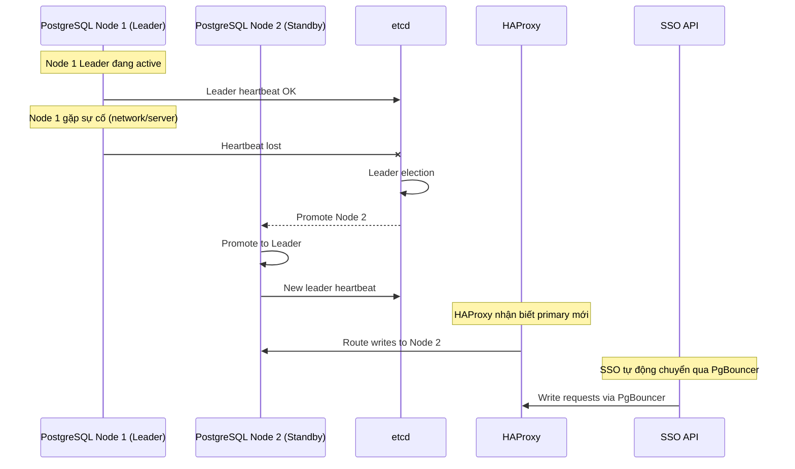

# Database HA Architecture

## Overview

SSO production sử dụng PostgreSQL High Availability thông qua Patroni, etcd, HAProxy và PgBouncer.

## Component Roles

| Component | Role |
|---|---|
| **Patroni** | Quản lý PostgreSQL cluster, streaming replication, leader election, automatic failover |
| **etcd** | Distributed consensus store cho Patroni, tránh split-brain |
| **HAProxy** | Route traffic đến PostgreSQL primary cho write |
| **PgBouncer** | Connection pooling, giảm số connection trực tiếp vào PostgreSQL |

## Connection Flow

```
SSO API
  └─> PgBouncer (:6432)
        └─> HAProxy (:5433)
              └─> PostgreSQL Primary (write)
              └─> PostgreSQL Replicas (read)
```

## Failover Flow



## Connection Manager

SSO có `DbConnectionManager` quản lý connection pools:

- `getWritePool()`: Connection tới PgBouncer (route tới primary)
- `getReadPool()`: Connection tới PgBouncer (hiện tại cùng endpoint - read/write chưa split)
- `getProjectPool(appCode)`: Connection tới project DB riêng

Xem chi tiết:
- Source: `src/db-manager/`
- Health: `src/health/`

## Monitoring

Health check endpoint `/health/dependencies` kiểm tra:
- PostgreSQL via direct query
- MongoDB via ping
- HAProxy stats
- PgBouncer admin
- Patroni API

Grafana dashboard: `infrastructure/monitoring/grafana/dashboards/postgres-ha-dashboard.json`

## Local Development

Local dev dùng `docker-compose.local.yml` với PostgreSQL và MongoDB đơn node. Không cần Patroni/HAProxy/PgBouncer ở local.

Xem `docker-compose.ha.yml` để biết cấu hình HA infrastructure local.
