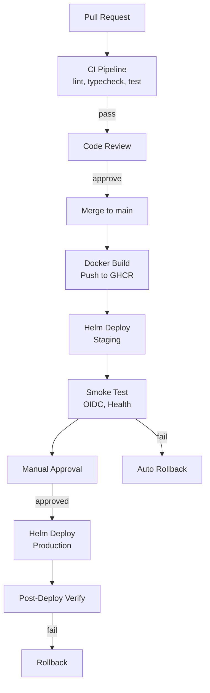

# Deployment Guide

## Environments

| Environment | Trigger | Approval |
|---|---|---|
| Development | Manual | None |
| Staging | CI push to `develop` hoặc manual | None |
| Production | Tag `v*` | Required |

## Deployment Flow



## Docker Image

- Build: `.github/workflows/docker-build.yml`
- Registry: `ghcr.io/OWNER/sso-api`
- Tags: SemVer (`v1.3.0`), Git SHA (`main-sha-abc1234`)

## Helm Chart

- Location: `infrastructure/helm/sso-api/`
- Values: `values.yaml` + environment overlay (`values-dev.yaml`, `values-staging.yaml`, `values-prod.yaml`)

## Kubernetes Resources

| Resource | File | Notes |
|---|---|---|
| Deployment | `templates/deployment.yaml` | replicaCount, image, resources |
| Service | `templates/service.yaml` | ClusterIP |
| Ingress | `templates/ingress.yaml` | TLS, host |
| HPA | `templates/hpa.yaml` | Autoscaling |
| PDB | `templates/pdb.yaml` | Pod Disruption Budget |
| Migration Job | `templates/migration-job.yaml` | Run on deploy |

## Migration

1. Migration chạy trước app rollout qua Kubernetes Job.
2. Job phải pass thì app mới rollout.
3. Migration phải backward compatible.
4. Rollback: ưu tiên forward-fix cho schema changes.

Xem chi tiết: `guide/08-kubernetes-helm-deployment.md`

## Rollback

```bash
helm rollback sso-api REVISION -n sso-prod --wait
```

Hoặc tự động qua CI khi smoke test fail.
