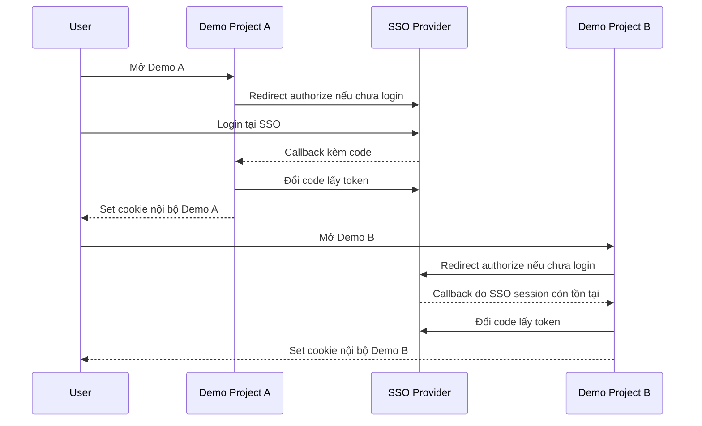

# Kế hoạch demo backend multi-project SSO

Tài liệu này là kế hoạch chính cho giai đoạn tạo 2 backend demo trước khi áp dụng vào Project A/B thật.

## 1. Mục tiêu

Tạo 2 backend demo mô phỏng Project A/B thật để chứng minh SSO hoạt động theo chuẩn OAuth2/OIDC cho nhiều dự án, không chỉ Project A/B.

Demo phải chứng minh được:

- SSO đóng vai trò Identity Provider giống Google.
- Mỗi project client vẫn giữ auth/session nội bộ riêng.
- Project client tự tạo session nội bộ sau khi tin token từ SSO.
- Không cần sửa SSO core khi thêm project mới, chỉ cần thêm client config và callback trong project.
- Có thể mở rộng từ 2 demo project sang nhiều project khác.

## 2. Phạm vi demo

Tạo thư mục:

```text
demo-projects/
  demo-project-a-api/
  demo-project-b-api/
```

Mỗi demo backend dùng:

- Express.js.
- TypeScript.
- Node.js.
- Sequelize.
- PostgreSQL.
- `express-automatic-routes`.
- JWT access token và refresh token.
- HttpOnly cookies `access_token`, `refresh_token`.

## 3. Setup hạ tầng local cho demo

Giai đoạn demo không cần thêm MongoDB, không bắt buộc sửa Docker Compose nếu PostgreSQL local/container hiện tại đã chạy.

Cần thêm:

- PostgreSQL database `demo_project_a`.
- PostgreSQL database `demo_project_b`.
- OIDC client registration trong SSO DB cho `demo-project-a-api` và `demo-project-b-api`.
- File `.env` riêng cho từng demo backend.

Không cần thêm:

- MongoDB riêng cho demo backend.
- Redis hoặc queue ở giai đoạn đầu.
- Kubernetes/Helm ở local.
- Thay đổi Project A/B thật.

Có 2 cách tạo DB demo:

1. Tạo thủ công bằng pgAdmin4 để dễ quan sát.
2. Sau này bổ sung script/migration tự động để người khác setup nhanh hơn.

## 4. Schema DB demo

Mỗi demo project có DB/schema riêng, mô phỏng gần giống Project A/B thật:

| Bảng | Mục đích |
|---|---|
| `users` | Thông tin user nội bộ project |
| `user_auth` | Thông tin auth/password/provider nội bộ project |
| `roles` | Vai trò nội bộ project |
| `permissions` | Quyền nội bộ project |
| `user_roles` | Mapping user-role |
| `user_sessions` | Session nội bộ project, lưu hash/encrypted token và trạng thái active |

Nguyên tắc:

- Demo project có auth/session riêng.
- SSO không ghi trực tiếp vào DB session của demo project.
- Callback demo project gọi service nội bộ để tạo session.

## 5. Endpoint demo bắt buộc

Mỗi demo backend cần có endpoint tối thiểu:

| Method | Endpoint | Mục đích |
|---|---|---|
| `GET` | `/health` | Kiểm tra demo backend đang chạy |
| `POST` | `/auth/login` | Login local kiểu cũ để mô phỏng project hiện tại |
| `POST` | `/auth/refresh` | Refresh token nội bộ |
| `POST` | `/auth/logout` | Logout và deactivate session |
| `GET` | `/auth/me` | Kiểm tra user hiện tại qua middleware `authenticate` |
| `GET` | `/auth/sso/start` | Bắt đầu login SSO, redirect sang SSO `/oauth/authorize` |
| `GET` | `/auth/sso/callback` | Nhận callback từ SSO, đổi code lấy token, tạo session nội bộ |

Các route phải viết theo Resource object của `express-automatic-routes`, không viết kiểu Express thủ công là chính.

## 6. Luồng login demo giống Google



Kết quả mong muốn:

- Login Demo A qua SSO thành công.
- Mở Demo B và login qua SSO không cần nhập lại password nếu SSO session còn tồn tại.
- Demo A và Demo B có session nội bộ riêng.
- Logout nội bộ từng demo không làm hỏng SSO core.

## 7. Client registration demo

SSO DB cần seed thêm hoặc cập nhật client demo:

| Client | Redirect URI local | Port đề xuất |
|---|---|---|
| `demo-project-a-api` | `http://localhost:3001/auth/sso/callback` | `3001` |
| `demo-project-b-api` | `http://localhost:3002/auth/sso/callback` | `3002` |

Scope tối thiểu:

```text
openid profile email offline_access
```

PKCE:

- Dùng `S256`.
- Không dùng `plain`.

## 8. Quy tắc bảo mật demo

- Không hardcode secret thật.
- Không commit `.env`.
- Không log access token, refresh token, authorization code, client secret.
- Token nội bộ demo phải hash/encrypt khi lưu `user_sessions`.
- Cookie phải là HttpOnly.
- Production/staging sau này phải bật Secure cookie khi dùng HTTPS.
- Validate `state` khi xử lý callback.
- Dùng PKCE `S256`.
- Không để SSO ghi trực tiếp vào DB demo project.

## 9. Kế hoạch triển khai coding sau khi tài liệu được duyệt

Sau khi tạo DB demo, cần tạo thêm code cho 2 backend demo trong VS Code. Tuy nhiên không phải làm thủ công rời rạc; code sẽ được tạo theo cấu trúc chuẩn trong workspace hiện tại.

Thứ tự triển khai:

1. Tạo cấu trúc `demo-projects/`.
2. Tạo base Express TypeScript cho `demo-project-a-api`.
3. Tạo base Express TypeScript cho `demo-project-b-api`.
4. Mỗi demo project có `package.json`, `tsconfig.json`, `.env.example`, source `src/` riêng.
5. Mỗi demo project có `.env` riêng trỏ tới DB riêng:
   - Demo A -> `demo_project_a`.
   - Demo B -> `demo_project_b`.
6. Thêm Sequelize config và model cho schema demo.
7. Implement model `User`, `UserAuth`, `Role`, `Permission`, `UserRole`, `UserSession`.
8. Implement local auth service, JWT service, session service.
9. Implement middleware `authenticate` và hàm `validateSession`.
10. Implement route Resource object cho local login/refresh/logout/me.
11. Implement route Resource object cho SSO start/callback.
12. Seed user/role/permission/session demo nếu cần thêm ngoài SQL đã chạy.
13. Seed/register OIDC clients trong SSO.
14. Chạy đồng thời 3 server:
    - SSO ở `http://localhost:3000`.
    - Demo A ở `http://localhost:3001`.
    - Demo B ở `http://localhost:3002`.
15. Chạy typecheck/build cho SSO và demo projects.
16. Test flow Demo A -> SSO -> Demo A -> Demo B -> SSO -> Demo B.

## 10. Tiêu chí hoàn thành

- Demo A chạy được ở `http://localhost:3001`.
- Demo B chạy được ở `http://localhost:3002`.
- SSO chạy được ở `http://localhost:3000`.
- Demo A login qua SSO thành công.
- Demo B login qua SSO thành công.
- User không cần nhập lại password khi chuyển từ Demo A sang Demo B nếu SSO session còn hiệu lực.
- Cookie/session nội bộ của Demo A và Demo B tách biệt.
- Không cần thay đổi SSO core khi thêm Demo B sau Demo A.
- Tài liệu đủ rõ để dùng làm bằng chứng xin phê duyệt sửa Project A/B thật.
